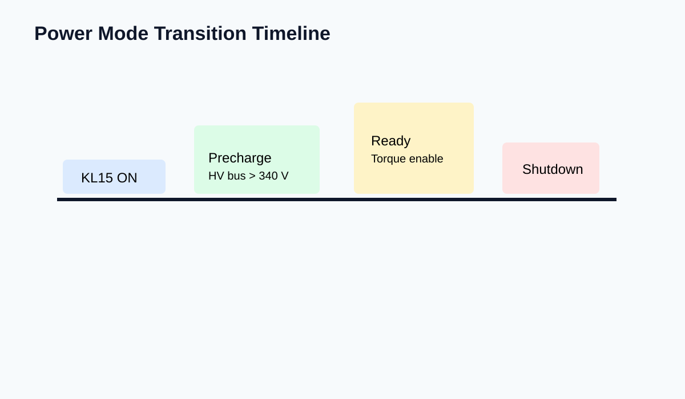

# HILS Power Mode Transition Notes

## Context

- 対象 ECU: VCU_A / INV_MAIN / BMS_SIM
- 観測目的: KL15 から READY までの遷移と、その途中の `PRECHARGE` 滞留条件
- 想定利用: 手順書RAGでのチャンク検索、異常系説明、ログ根拠の抽出

## Timeline Snapshot



1. `KL15=ON`
2. `VCU.PowerMode = BOOT`
3. `HV_PrechargeRelay = ON`
4. `HVBus >= 340V`
5. `INV_MAIN.State = READY`

## What Usually Goes Wrong

### Case 1: PRECHARGE stall

- 症状: `INV_MAIN.State=PRECHARGE` のまま 2.0 s を超える
- まず疑うもの:
  - PSU current limit
  - battery model initial SOC mismatch
  - relay feedback inversion

```text
[09:02:11.004] KL15 ON
[09:02:11.292] Precharge relay ON
[09:02:13.401] HVBus = 301.8V
[09:02:13.408] timeout -> PRECHARGE_STALL
```

### Case 2: READY entered, torque still blocked

- 状況としては READY でも、別系統で `TorquePathInhibit=1` が残る
- この場合は power mode の問題ではなく、driveline interlock か diag session 残留の可能性が高い

## Review Chunk Candidates

| Chunk candidate | Why it is useful |
| --- | --- |
| Preconditions block | 起動前条件だけを検索したいケースがある |
| Timeline steps | 状態遷移の系列知識として切り出しやすい |
| Failure snippets | ログ由来の問いに強い |
| Recovery hints | 単なる事象説明と対策を分離できる |
